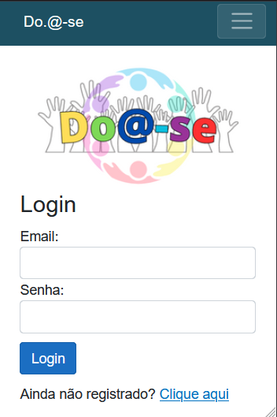

<h1 align="center"> # Do.@-se App </h1>

  

<h2>1. Justificativa:</h2>

O presente projeto apresentado por meio deste repositório é a conclusão de um processo de idealização e desenvolvimento iniciado no segundo semestre de 2021 e concluído no fim do ano de 2023. Sua implementação serviu como <strong>método avaliativo para as disciplinas de Projeto Integrador de I a V, ministradas durante o curso tecnólogo de Análise e Desenvolvimento de Sistemas na instituição UNIVAG (Universidade de Várzea Grande).</strong>

<h2>2. Título e descrição do projeto:</h2>

A solução Do.@-se foi pensada e criada para ser um aplicativo no qual pessoas e entidades poderiam interagir na forma de criação de campanhas sociais para arrecadação de bens e valores, a fim de que esta solução fosse contributiva para influenciar o Brasil na sua adequação às <a href="https://brasil.un.org/pt-br/sdgs" target="_blank">metas de desenvolvimento sustentável da ONU até 2030</a>, sobretudo no que diz respeito às metas de erradicação da probreza e fome zero.

<h2>3. Instruções de Instalação:</h2>

Para rodar o projeto em sua máquina, são necessários os seguintes pré-requisitos:
  
<ul>
    <li style="display: inline-block;">
        <strong>Requisito 1:</strong> Instalar o <a href="https://visualstudio.microsoft.com/pt-br/downloads/">Visual Studio 2022</a>
    </li>
     <li style="display: inline-block;">
        <strong>Requisito 2:</strong> Instalar a <a href="https://dotnet.microsoft.com/pt-br/download/dotnet/7.0">.NET Framework SDK 7.0.13 </a>
    </li>
</ul>

 Após as intalações necessárias, execute o projeto e, na aba de Ferramentas, na opção de Gerenciar Pacotes NuGet, o Visual Studio reconhecerá as bibliotecas necessárias para execução, conforme a imagem: 

 Concluídas as operações acima, já é possível rodar o projeto: 

  

Pronto! Agora é possível utilizar o aplicativo!

<strong>As credenciais admin são:</strong>

<ul>
    <li style="display: inline-block;">
        <strong>Login:</strong> 1</a>
    </li>
     <li style="display: inline-block;">
        <strong>Senha:</strong> 1</a>
    </li>
</ul>

<h2>4. Documentações:</h2>

Durante a idealização e planejamento do projeto foram elaboradas algumas documentações, aqui estão as principais 

<ul>
    <li style="display: inline-block;">
        <strong><a href="Apresentação em Power Point referente ao projeto de negócios, justificativas de mercado e ideias de implementações inciais:</strong>
    </li>
     <li style="display: inline-block;">
        <strong>Requisito 2:</strong> Instalar a <a href="https://dotnet.microsoft.com/pt-br/download/dotnet/7.0">.NET Framework SDK 7.0.13 </a>
    </li>
</ul>

  
  
